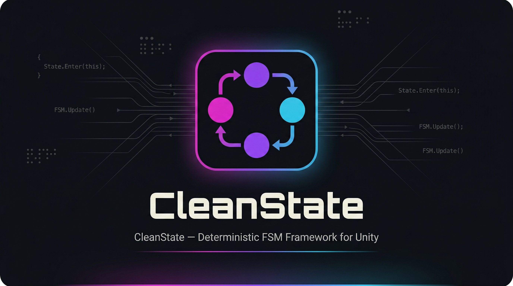

<p align="center">
  
</p>

<h1 align="center">CleanState</h1>

<p align="center">
  <strong>Deterministic FSM Framework for Unity</strong><br/>
  A performance-tuned, event-driven state orchestration engine with full debugging and recovery support.
</p>

<p align="center">
  
  
  
  
  
</p>

> **Note:** This repository is a work in progress and was made public early to support CI/CD infrastructure. APIs, documentation, and samples may change. Not yet ready for production use.

---

## 🚀 What is CleanState?

**CleanState is not just another FSM** — it's a **deterministic orchestration engine** for complex systems where:

- execution must be **predictable**
- transitions must be **traceable**
- systems must be **recoverable**
- performance must be **tight**

Instead of frame-driven updates or coroutine chains, CleanState uses a:

> **Run-until-blocked, event-driven execution model**

Built in pure C# with no engine dependencies.
The Unity debugger is a read-only projection — the core remains the single source of truth.

If you've ever asked:
- *"Why did this state change?"*
- *"Where is execution stuck?"*
- *"How do I recover this flow safely?"*

CleanState is built to answer those questions directly.

**Designed for:**
- Gameplay engineers
- Tools engineers
- Teams building complex, state-heavy systems

---

## 🧨 The Problem with Typical FSMs

Most FSM implementations *work fine at small scale* — until they don't.

### 🔁 Frame-Driven Execution (`Update()` Loops)

```csharp
void Update()
{
    currentState.Update();
}
```

Logic runs every frame — even when nothing is happening. Hidden dependencies emerge between states. Wasted CPU, hard-to-reason execution order, subtle bugs.

### 🧵 Coroutine-Based Flow

```csharp
yield return WaitUntil(() => conditionMet);
yield return WaitForSeconds(1.0f);
yield return WaitUntil(() => somethingElse);
```

Execution is split across multiple frames with no explicit control flow. State is hidden inside Unity. Hard to trace, impossible to recover mid-flow, debugging becomes guesswork.

### 🔍 Debugging is Opaque

When something breaks, you don't know **which step failed**, **why a transition happened**, or **what triggered it**.

> "Something transitioned… but I'm not sure why."

### 🔗 Tight Coupling to Unity

Typical FSMs depend on MonoBehaviours, Update loops, and coroutines. Not portable, hard to test, hard to reuse.

### 🔄 No Recovery Model

Most systems assume execution never stops. Real systems don't. Inconsistent state, broken flows, reset hacks.

### 💥 The Root Problem

> **Execution is implicit instead of explicit.**

Typical FSM debugging:
> *"Something transitioned… I think?"*

CleanState debugging:
> *"AwaitPick → Reveal because EventReceived(PlayerPicked) at 12.34s"*

---

## ✅ How CleanState Solves This

| Problem | CleanState |
|---|---|
| Frame-driven waste | **Run-until-blocked** — sleeps when idle, zero cost |
| Hidden execution | **Explicit step pipelines** — every step has a name, type, source location |
| Opaque transitions | **Full transition provenance** — reason, trigger, source, destination, timestamp |
| Engine coupling | **Pure C# core** — no MonoBehaviour, no coroutines, no Unity types |
| No recovery | **Checkpoint-based recovery** — restore from domain truth, not FSM position |
| Can't debug | **Visual debugger** — live state, timeline, breakpoints |

---

## ⚡ Quick Start

### Define a machine

```csharp
var definition = new MachineBuilder("PickGame")
    .State("AwaitPick")
        .Checkpoint()
        .TransitionIn(ctx => SetupPick(ctx), "SetupPick")
        .WaitForEvent("PlayerPicked", "WaitForPick")
        .Then(ctx => ProcessPick(ctx), "ProcessPick")
        .GoTo("Reveal", "GoToReveal")
    .State("Reveal")
        .TransitionIn(ctx => BeginReveal(ctx), "BeginReveal")
        .WaitForEvent("RevealFinished", "WaitForReveal")
        .Then(ctx => PresentOutcome(ctx), "PresentOutcome")
        .Decision("RevealDecision")
            .When(ctx => HasMorePicks(ctx), "AwaitPick", "HasMorePicks")
            .Otherwise("Done", "NoMorePicks")
    .State("Done")
        .Then(ctx => ShowSummary(ctx), "ShowSummary")
    .Build();
```

### Run it (standalone)

```csharp
var scheduler = new Scheduler();
var machine = scheduler.CreateMachine(definition);
machine.Start(currentTime);

// Each frame:
scheduler.Update(currentTime);

// Send events when things happen:
// Event IDs are compiled from string names at build time for zero-allocation runtime lookup.
var pickEvent = MachineBuilder.EventIdFrom(definition, "PlayerPicked");
machine.SendEvent(pickEvent, currentTime);
```

### Run it in Unity

```csharp
// Add FsmRunner to a GameObject, then:
var machine = fsmRunner.CreateAndStart(definition);

// Send events:
var pickEvent = MachineBuilder.EventIdFrom(definition, "PlayerPicked");
fsmRunner.SendEvent(pickEvent);
```

Open **Window > CleanState > FSM Debugger** to see the machine running in real time.

---

## ⚙️ Execution Model

> **Run immediately until blocked. Sleep until awakened.**

A machine executes steps sequentially in a single call until it hits a blocking condition:

| Block Kind | Resumes When |
|---|---|
| WaitForEvent | Matching event is delivered |
| WaitForTime | Current time >= target time |
| WaitForPredicate | Predicate returns true |
| WaitForChild | Child machine completes |

The scheduler calls `Update(currentTime)` each frame. Only blocked machines with satisfiable conditions are ticked — idle machines cost nothing.

---

## 🧩 Architecture

```
+----------------------------+
| Unity Layer (optional)     |     Disposable projection.
| GraphView, FsmRunner       |     Reads from core via extension methods.
+-------------+--------------+     Never the source of truth.
              |
              v
+----------------------------+
| Core FSM (pure C#)         |     Source of truth.
| MachineDefinition, Machine |     Engine-agnostic. No Unity types.
| Builder, Scheduler, Debug  |     Targets netstandard2.0.
+----------------------------+
```

The Unity layer is strictly observation-only. It cannot mutate machine state, modify context, or force transitions — those go through an explicit, opt-in `FsmDebugController`.

---

## 🧩 State Regions (Multiple Active States)

Some systems require multiple independent states to be active at the same time.

For example, a player in a shooter might be:

- **Running** (movement)
- **Crouched** (posture)
- **Aiming** (weapon)

These are not a single state — they are independent dimensions of behavior.

### ❌ The Wrong Approach

Trying to model this in one FSM leads to state explosion:

```
RunningCrouchedAiming
RunningStandingAiming
WalkingCrouchedHipFire
...
```

This quickly becomes unmanageable.

### ✅ The CleanState Approach

CleanState keeps each concern in its own machine:

```
LocomotionMachine
PostureMachine
WeaponMachine
```

These machines run side-by-side under the same scheduler via `CompositeStateMachine`:

```
Locomotion: Running
Posture:    Crouched
Weapon:     Aiming
```

> **A single machine models one concern.**
> **Complex behavior is built by composing multiple machines.**

### ⚙️ Example

```csharp
var player = new CompositeStateMachine("PlayerState");
player.AddRegion("Locomotion", locomotionDef);
player.AddRegion("Posture", postureDef);
player.AddRegion("Weapon", weaponDef);

// Cross-region constraint: running forces standing
player.AddConstraint((composite, time) =>
{
    if (composite.GetRegionState("Locomotion") == "Running"
        && composite.GetRegionState("Posture") == "Crouched")
    {
        composite.SendEvent("Posture", "Stand", time);
    }
});

player.Start(time);
player.Update(time);
```

### 🔄 Coordination Between Regions

Regions can coordinate through:

- **Shared context** — each region can read other regions' state via `__region.{name}` context keys
- **Events** — send targeted or broadcast events (e.g., `ReloadStarted`, `SprintBlocked`)
- **Constraints** — explicit rules evaluated after each update

### 🔍 Debugging

Each region is fully observable:

- Current state per region
- Transitions per region
- Independent breakpoints and trace buffers

This avoids the complexity of debugging a single "mega-state".

### 🧠 When to Use State Regions

**Use multiple machines when:**

- Behaviors are independent but simultaneous
- You want to avoid combinatorial state explosion
- Different systems evolve separately

**Use a single machine when:**

- Modeling a linear or branching flow
- Orchestrating a single feature (UI, gameplay loop, etc.)

State Regions let you scale complexity without losing clarity.

👉 **See the full example:** [`samples/CompositeRegions`](samples/CompositeRegions/README.md)

---

## 🛠 Debugging & Visualization — First-Class Feature

> *This is why you pick CleanState.*

CleanState includes a **runtime FSM debugger** built for real systems — not toy demos.

This is where most FSMs fail. CleanState makes execution fully observable.

<!-- TODO: Add GIF showing live state highlighting, step tracking, transition flash, breakpoint hit, timeline scrub -->
<!-- <p align="center"></p> -->

### 🎯 Live State Highlighting

Active state glows with a status bar. The active step within the state is highlighted. Block reason is specific, not generic:

```text
Waiting for event: PlayerReady
Waiting until t=15.0s
Waiting for condition
```

Visual indicators:
* 🟢 Running
* 🟠 Blocked
* 🔵 Completed
* 🔴 Faulted

### 🔍 Step-Level Visibility

Each state node lists its steps with type-specific icons and coloring:

```text
▶ ⧖ WaitForEvent (PlayerReady)     ← active step
  • Action (Initialize)
  ◢ Decision (HasMorePicks)
  → GoTo (Reveal)
```

This solves the "which part of the fluent chain failed" problem visually.

### 🔄 Transition Reason Tracking

Every transition records full provenance:

```text
AwaitPick → Reveal
Reason: EventReceived
Detail: PlayerPicked
Time: 12.34s
```

The last transition edge lights up green on the graph. Tooltip shows reason kind, detail, and timestamp — tying directly into the provenance system.

### 📜 Timeline / Trace Playback

A panel at the bottom of the window shows recent transitions from the trace buffer:

* Last 16 transitions stored
* Click any entry to scrub the graph to that point in history
* ◀ / ▶ step navigation through transitions
* "Live" button returns to real-time mode

This turns CleanState into an **FSM debugger**, not just a viewer.

> You can debug how the system *behaved* — not just where it is now.

### 🛑 Breakpoints

Most FSM systems don't support breakpoints. CleanState treats execution like debuggable code.

Click the red dot on any state node to set a breakpoint. Supports:

* **State entry** — pause when entering a state
* **Step execution** — pause at a specific step index
* **Transition reason** — pause when a transition fires for a given reason (DecisionBranch, EventReceived, etc.)

```text
BREAKPOINT HIT — StateEntry (Reveal)
[Resume]  [Step]
```

When hit, the debug toolbar shows the breakpoint kind and the machine waits for Resume or Step.

### 🔒 Strict Debug Boundary

The debugger is observation-only. It cannot:
* Modify `MachineContext` data
* Force transitions without `FsmDebugController`
* Drive step execution from editor hooks
* Cache state that feeds back into the FSM

Debug commands (pause, step, jump, breakpoints) go through `FsmDebugController` — an explicit opt-in that the machine owner creates. The editor only sees `IFsmObservable`, never the raw `Machine`.

---

## 🔄 Recovery

Machines can be recovered from persisted state using domain truth, not FSM position:

```csharp
// Capture at a checkpoint
var snapshot = MachineRecovery.CaptureSnapshot(machine, "score", "picksRemaining");

// Later, restore from snapshot
var newMachine = scheduler.CreateMachine(definition);
MachineRecovery.RestoreFromSnapshot(newMachine, snapshot, currentTime);
```

Preferred recovery points are stable checkpoints (await input, reveal complete, summary displayed) — not mid-animation or transient steps.

---

## 📦 Project Structure

```
src/CleanState/                     Core library (netstandard2.0)
  Identity/                         StateId, EventId, MachineId, NameLookup
  Steps/                            IStep, ActionStep, WaitForEventStep,
                                    WaitForTimeStep, WaitForPredicateStep,
                                    DecisionStep, TransitionStep, MachineContext
  Runtime/                          Machine, MachineDefinition, StateDefinition,
                                    Scheduler, EventQueue, IFsmObservable
  Builder/                          MachineBuilder, StateBuilder, DecisionBuilder
  Debug/                            StepDebugInfo, TransitionTrace, TraceBuffer,
                                    FsmExecutionException, DebugSnapshot,
                                    FsmDebugController, FsmBreakpoint
  Recovery/                         MachineSnapshot, MachineRecovery, CheckpointId

tests/CleanState.Tests/             69 tests (net8.0, NUnit)

unity/CleanState.Unity/             Unity package (optional)
  Runtime/                          FsmRunner, FsmDebugRegistry, MachineExtensions
  Editor/                           FsmGraphWindow, FsmGraphView, FsmStateNode,
                                    FsmTimelinePanel, FsmRunnerInspector
```

---

## 🏗 Building

```bash
# Build the core library
dotnet build src/CleanState/CleanState.csproj

# Run all tests
dotnet test tests/CleanState.Tests/CleanState.Tests.csproj
```

### Unity Setup

1. Build `CleanState.dll` and place it in your Unity project's `Plugins/` folder
2. Copy `unity/CleanState.Unity/` into `Packages/` (or reference as a local package)
3. Add `FsmRunner` to a GameObject
4. Build machines with the fluent API and call `fsmRunner.CreateAndStart(definition)`
5. Open **Window > CleanState > FSM Debugger**

---

## 🧪 Test Coverage

> Fully tested core — **69 tests** across execution, recovery, debugging, and architectural boundaries.

| Suite | Count | Coverage |
|---|---:|---|
| MachineBuilderTests | 6 | Build validation, error cases |
| MachineExecutionTests | 8 | Actions, transitions, events, time, predicates, decisions |
| SchedulerTests | 3 | Broadcast events, lifecycle, targeted delivery |
| RecoveryTests | 3 | Snapshot capture / restore |
| ObservationBoundaryTests | 16 | IFsmObservable enforces read-only surface |
| SourceOfTruthTests | 12 | Definition integrity, no Unity serialization in core |
| DebugFeatureTests | 21 | Breakpoints, enriched snapshots, trace buffer, step visibility |
| **Total** | **69** | |

---

## 🎮 Samples

CleanState includes runnable samples demonstrating real-world orchestration problems — not just simple state transitions.

---

### 🎰 PickGame (Flagship Example)

A slot-style pick game flow with looping and branching behavior.

**Demonstrates:**

- Repeated state loops (`AwaitPick → Reveal → decision → repeat`)
- Event-driven progression (`PlayerPicked`)
- Timed waits (`RevealPause`, `SummaryPause`)
- Checkpoints and recovery-friendly boundaries
- Transition tracing, timeline playback, and breakpoints

**Why it matters:**

Most FSMs break down under looping + branching complexity.
CleanState keeps the entire flow explicit and debuggable.

👉 **Start here:** [`samples/PickGame`](samples/PickGame/README.md)

---

### 🖥 UI Flow Orchestration

A structured multi-step onboarding flow replacing coroutine-driven logic.

**Demonstrates:**

- Sequential state orchestration
- Waiting on user input and async events
- Conditional branching (permissions granted vs. skipped)
- Clean replacement for coroutine-based flows
- No `Update()` loops or boolean flags

**Why it matters:**

Replaces fragile UI logic with a deterministic execution model.

👉 **See:** [`samples/UIFlow`](samples/UIFlow/README.md)

---

### 🔄 Recovery / Resume Demo

Simulates interruption and restoration of an active state machine.

**Demonstrates:**

- Snapshot capture with domain data
- JSON serialization of machine state
- Recovery to logical checkpoints
- Deterministic resume behavior after complete machine destruction

**Why it matters:**

Most FSM systems cannot recover safely — CleanState is built for it.

👉 **See:** [`samples/RecoveryDemo`](samples/RecoveryDemo/README.md)

---

### ⚙️ Task Orchestration (Non-Game)

A document processing pipeline proving CleanState works beyond games.

**Demonstrates:**

- Input validation with pass/fail branching
- External service calls with retry logic (3 attempts, backoff delays)
- Timeout handling and dead letter queue
- Full pipeline traceability across every phase and retry

**Why it matters:**

Proves this isn't just for Unity — it's a general orchestration engine.

👉 **See:** [`samples/TaskOrchestration`](samples/TaskOrchestration/README.md)

---

### 🔀 Parallel / Sidecar Behavior (Advanced)

Three machines running concurrently on a shared scheduler.

**Demonstrates:**

- Main flow with independent sidecar machines (hints + watchdog)
- Cross-machine event communication
- Independent trace buffers per machine
- Watchdog timeout forcing the main flow to end

**Why it matters:**

Shows scheduler power and non-blocking parallel orchestration — no shared booleans, no coupled Update loops.

👉 **See:** [`samples/ParallelSidecar`](samples/ParallelSidecar/README.md)

---

### 🧩 Composite State Regions (Orthogonal Composition)

Three orthogonal state machines modeling a player character — no combinatorial explosion.

**Demonstrates:**

- `CompositeStateMachine` coordinating independent regions
- Aggregate state tuple: `{ Locomotion: Running, Posture: Crouched, Weapon: Aiming }`
- Cross-region constraints (running forces standing posture)
- 8 total states instead of 18+ in a monolithic FSM

**Why it matters:**

Monolithic FSMs multiply states for every new concern. Orthogonal regions add a machine, not a multiplicative explosion.

👉 **See:** [`samples/CompositeRegions`](samples/CompositeRegions/README.md)

---

### ▶ Running the Samples

```bash
git clone https://github.com/JosephFernald/CleanState
cd CleanState

dotnet run --project samples/PickGame/PickGame.csproj
dotnet run --project samples/UIFlow/UIFlow.csproj
dotnet run --project samples/RecoveryDemo/RecoveryDemo.csproj
dotnet run --project samples/TaskOrchestration/TaskOrchestration.csproj
dotnet run --project samples/ParallelSidecar/ParallelSidecar.csproj
dotnet run --project samples/CompositeRegions/CompositeRegions.csproj
```

Each sample highlights a specific problem CleanState solves.
**If you're new, start with PickGame.**

---

## 📈 Roadmap

- [ ] WaitForAll / WaitForAny composite blocks
- [ ] Child / sub-state machines
- [ ] Parallel machine execution model
- [ ] Snapshot serialization helpers
- [ ] Advanced debug inspector UI
- [ ] Data-oriented runtime optimization

---

## 💡 Design Principles

1. Engine-agnostic core
2. Event-driven execution
3. Run-until-blocked model
4. Recovery from stable checkpoints
5. Explicit step identity
6. Transitions carry provenance
7. Performance-first runtime
8. Debugging is first-class
9. Definition is the source of truth
10. Observation only — no implicit coupling

---

## 💡 Why CleanState Exists

> CleanState turns state machines from black boxes into fully observable systems.

Because most FSMs become fragile as systems grow.

CleanState is built for:

* complex orchestration
* real production workflows
* systems that must be **understood, not guessed**

---

## 📄 License

MIT License — free for commercial and non-commercial use.

---

## 🤝 Contributing

Contributions welcome.

---

## ⭐ Support

If this project helps you — star the repo, share it, use it in production.

---

<p align="center">
  <strong>CleanState</strong><br/>
  Deterministic systems. Predictable behavior. Zero guesswork.
</p>
